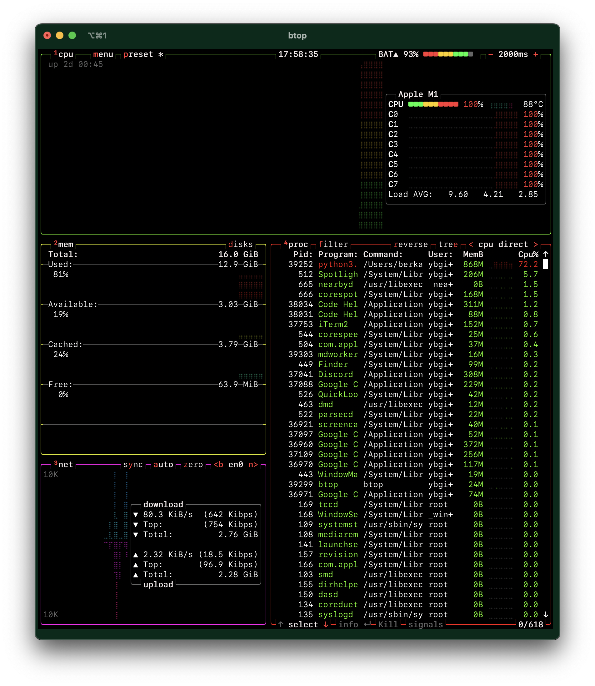

# Hand-Writing-Recognition
Hand Writing Recognition From Scratch

__outputs and any other variables can be seen inside of the [ipynb file](simple-mnist-nn-from-scratch-numpy-no-tf-keras.ipynb)__

## System usage during training:
* Macbook Air M1
* 16 GiB
* 256 GiB 

